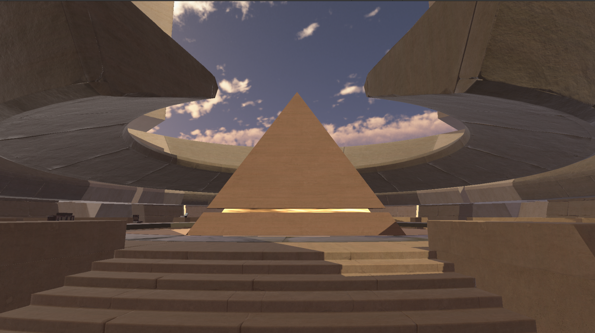

# The Courtyard (Universal Render Pipeline / URP)
This is a repository for people who wants to use 'The Courtyard' scene from Unity without the extra features and only the 3d models itself. Basically this is a cleaner version of the unity's courtyard demo. Project is using universal render pipeline.

# Requirements
1. Project is using Unity 2022 LTS. If you want to use older versions, try downloading the .unitypackage file instead and just import that into your unity project.
2. Universal Render Pipeline.

# Features / Limitations
1. Only the 3d models, no skybox, baked lightmap, custom scripts, etc.
2. Some props have been deleted from the scene.
3. Only 1 directional light in the scene.
4. There is an extra scene that has a statue model taken from the Enemies demo, this was only used for my yt tutorial.

# Purpose
This is mainly targeted towards testing lighting conditions, global illumination, and alternatives to cornell box or sponza atrium.
